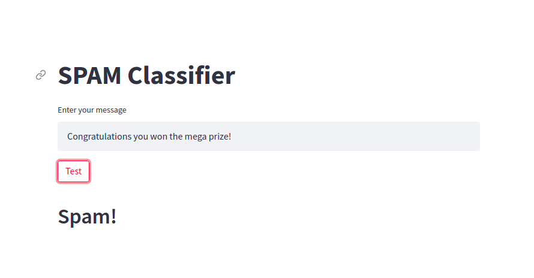

# spam-classifier

This is ML project that distinguishes whether a message is Spam or Not Spam using Naive Bayes Classifier. 
The ML algorithm has been implemented in Google Colab using python libraries -- spamClassifier.ipynb. 

## Output:

